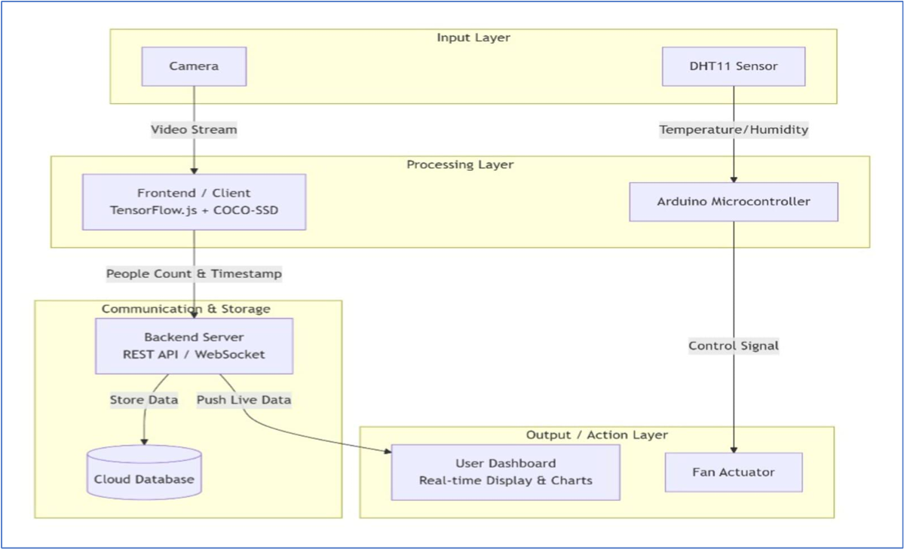

<h1 align="center">Hi 👋, I'm ThermoSense</h1>
<h3 align="center">Smart Thermal-Based Occupancy Detection and Intelligent Ventilation Control System</h3>

- 🔭 I’m currently working on [ThermoSense](https://github.com/nithishc16/ThermoSense-IoT)

- 🌱 I’m currently learning **Spring Boot & Microservices ,Embedded Systems with Arduino ,IoT Communication Protocols (MQTT, HTTP) ,Computer Vision & Edge AI**

- 👯 I’m looking to collaborate on [ThermoSense](https://github.com/nithishc16/ThermoSense-IoT)

- 🤝 I’m looking for help with [ThermoSense](https://github.com/nithishc16/ThermoSense-IoT)

- 👨‍💻 All of my projects are available at [https://github.com/nithishc16](https://github.com/nithishc16)

- 💬 Ask me about **IoT, Java, Spring Boot, Arduino, Smart Building Systems**

- 📫 How to reach me **nithishc67@gmail.com**

- 📄 Know about my experiences [www.linkedin.com/in/nithishc16](www.linkedin.com/in/nithishc16)

- ⚡ Fun fact **I enjoy turning real-world problems into smart automation solutions 😄**

<h3 align="left">Connect with me:</h3>

<h3 align="left">Languages and Tools:</h3>

            

🏢 CrowdOracle - Smart Crowd Monitoring Platform

  

 <strong>AI-Powered Real-Time Occupancy Tracking with Environmental Automation</strong> 

 <a href="#key-features">Features</a> • <a href="#tech-stack">Tech Stack</a> • <a href="#installation">Installation</a> • <a href="#hardware-setup">Hardware</a> • <a href="#usage">Usage</a> • <a href="#troubleshooting">Troubleshooting</a> 

📊 Overview
CrowdOracle is an intelligent monitoring system that combines computer vision AI with IoT sensors to provide real-time crowd analytics and automated environmental control. Designed for spaces requiring occupancy management and climate regulation.

✨ Key Features

Feature	Description	Benefit
🤖 Real-time AI Tracking	WebGL-accelerated people detection	Instant occupancy counting
🔒 Privacy-First Design	Local processing, no video transmission	GDPR compliant, secure
🌡️ Environmental Automation	Smart HVAC/fan control based on thresholds	Energy efficient, comfortable
📈 Live Analytics Dashboard	Real-time visualization of all metrics	Informed decision making
🔀 Dual Data Ingestion	Web agents + physical sensor fusion	Comprehensive data collection

🛠️ Technology Stack
Backend Layer
yaml
Language: Java 21
Framework: Spring Boot 3.5.5
Security: Spring Security
Database: PostgreSQL
Serial Communication: jSerialComm
Frontend Layer
yaml
Core: HTML5, Vanilla JavaScript
Styling: TailwindCSS
AI/ML: TensorFlow.js
Icons: FontAwesome
IoT Layer
yaml
Microcontroller: Arduino
Language: C++
Libraries: DHT, LiquidCrystal_I2C, Wire
Protocols: I2C, Serial
⚙️ Prerequisites
Software Requirements
✅ Java 21 or higher

✅ PostgreSQL 12+

✅ Node.js 18+ (for development)

✅ Arduino IDE 2.0+

✅ Modern web browser (Chrome 90+, Edge 90+)

Hardware Requirements
✅ Arduino Board (Uno/Mega)

✅ DHT11 Temperature/Humidity Sensor

✅ LCD Display (I2C)

✅ Motor/Driver Module

✅ Webcam (for AI detection)

🚀 Quick Installation Guide
Step 1: Database Setup
sql
-- Create database
CREATE DATABASE CrowdOracle;

-- Verify creation
\l CrowdOracle;
Step 2: Backend Configuration
Edit Backend/src/main/resources/application.properties:

properties
# Database Configuration
spring.datasource.url=jdbc:postgresql://localhost:5432/CrowdOracle
spring.datasource.username=your_username
spring.datasource.password=your_password

# Serial Port Configuration
serial.port.name=COM3        # Windows: COM3, COM4
# serial.port.name=/dev/ttyUSB0  # Linux/Mac
serial.enabled=true
serial.baud.rate=9600
Step 3: Hardware Connection Guide

Component	Pin	Function	Color Code
DHT11	7	Data	Yellow
Motor Enable	9	PWM Speed	Orange
Motor IN1	10	Direction	Green
Motor IN2	11	Direction	Blue
LCD SDA	A4	I2C Data	Purple
LCD SCL	A5	I2C Clock	Gray

Step 4: Arduino Firmware
Install Libraries via Arduino IDE Library Manager:

text
DHT sensor library
Adafruit Unified Sensor
LiquidCrystal I2C
Upload Code:

bash
# Open Arduino IDE
File → Open → Iot/AurdinoConfig.ino
Tools → Board → Arduino Uno
Tools → Port → Select your port
Sketch → Upload
Step 5: System Startup
Backend Server
bash
# Navigate to backend directory
cd Backend

# Run Spring Boot application
./mvnw spring-boot:run

# Expected output:
# Started CrowdOracleApplication in 5.632 seconds
# Serial port listener started on COM3
Frontend Dashboard
Open frontend/index.html in Chrome/Edge

Allow camera access when prompted

Click "Initialize Feed" button

Monitor system status indicators

🖥️ Dashboard Interface
javascript
// System Status Indicators
🟢 Camera: Connected
🟢 AI Model: Loaded
🟢 Arduino: Online
🟢 Database: Syncing

// Real-time Metrics
👥 Occupancy: 12/50
🌡️ Temperature: 24°C
💧 Humidity: 65%
🌀 Fan Speed: Medium
🔧 Troubleshooting Matrix
Symptom	Possible Cause	Solution
❌ "Serial port not found"	Wrong port name	Update application.properties
❌ Camera access denied	Browser permissions	Allow camera in settings
❌ Database error	PostgreSQL not running	Start PostgreSQL service
❌ Arduino not detected	Driver issues	Reinstall USB drivers
❌ AI model not loading	Network blocked	Check firewall settings
📈 System Architecture
text
┌─────────────────┐    ┌─────────────────┐    ┌─────────────────┐
│   Web Camera    │────▶│  TensorFlow.js  │────▶│  People Count  │
│   (Client-side) │    │   (WebGL AI)    │    │   Statistics    │
└─────────────────┘    └─────────────────┘    └────────┬────────┘
                                                      │
┌─────────────────┐    ┌─────────────────┐    ┌───────▼────────┐
│  Arduino Sensors │────▶│  Spring Boot    │◀───┤  PostgreSQL   │
│  (DHT11, Motor)  │    │   (REST API)    │    │   Database    │
└─────────────────┘    └─────────────────┘    └────────────────┘
                              │
                      ┌───────▼────────┐
                      │  Web Dashboard  │
                      │  (Real-time UI) │
                      └─────────────────┘
🚦 Usage Scenarios
Scenario 1: Conference Room Management
Setup: Camera facing entrance, sensors in room

Action: Automatic AC adjustment based on occupancy

Alert: Notification when capacity reaches 80%

Scenario 2: Retail Store Analytics
Setup: Overhead camera, entrance sensors

Action: Fan control based on heat from crowds

Analytics: Peak hour reporting

Scenario 3: Library Monitoring
Setup: Multiple zones with separate sensors

Action: Quiet zones maintained via environmental control

Privacy: No video storage, only counts

🔐 Security & Privacy
✅ No video storage - only numerical counts

✅ Local processing - AI runs in browser

✅ Encrypted transmission - HTTPS for data

✅ Access control - Spring Security integration

✅ GDPR compliant - anonymous data only

📚 API Reference
GET /api/occupancy
json
{
  "currentCount": 15,
  "maxCapacity": 50,
  "timestamp": "2024-01-14T10:30:00Z",
  "zone": "main_hall"
}
POST /api/fan-control
json
{
  "speed": "HIGH",
  "temperature": 28.5,
  "autoMode": true
}
